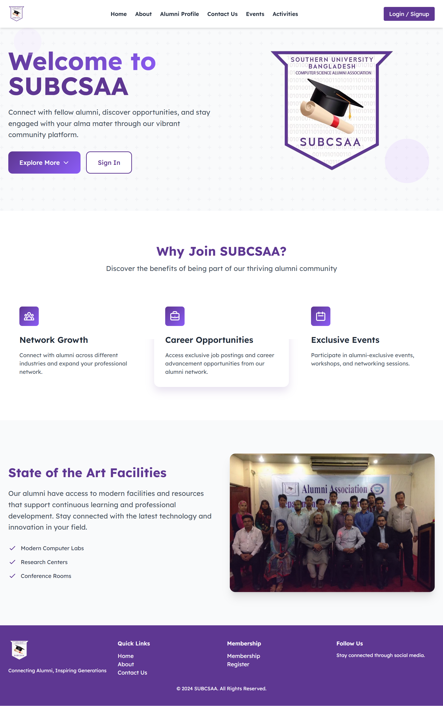
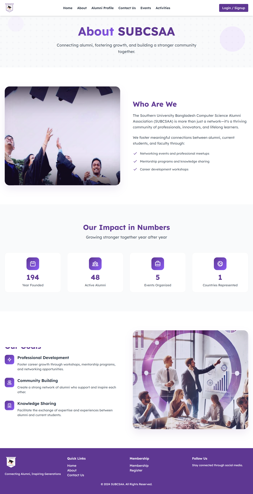
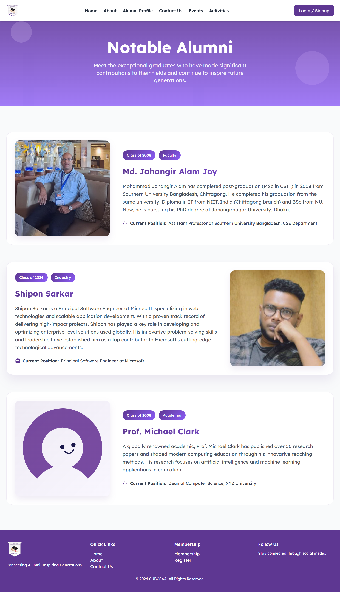
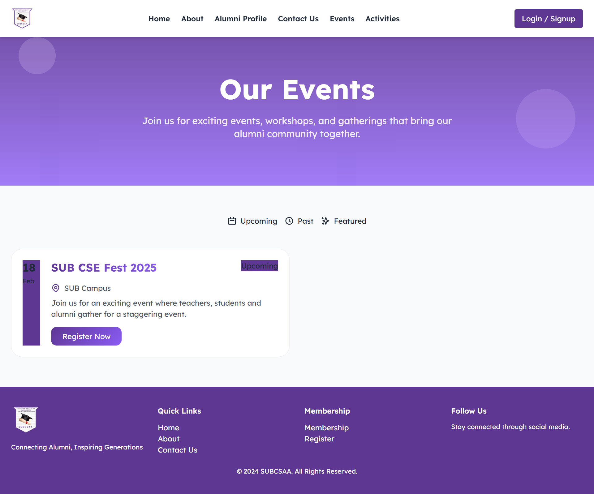
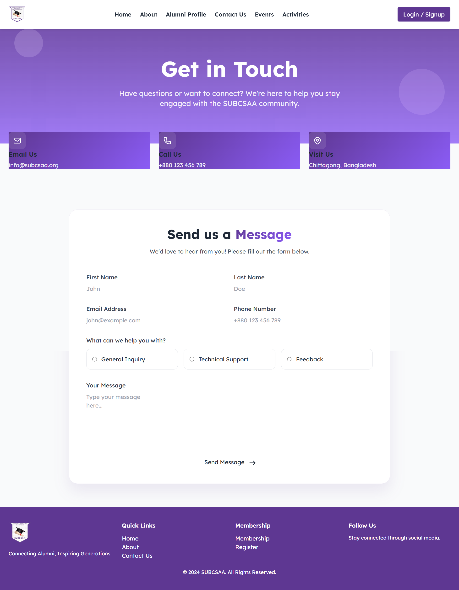
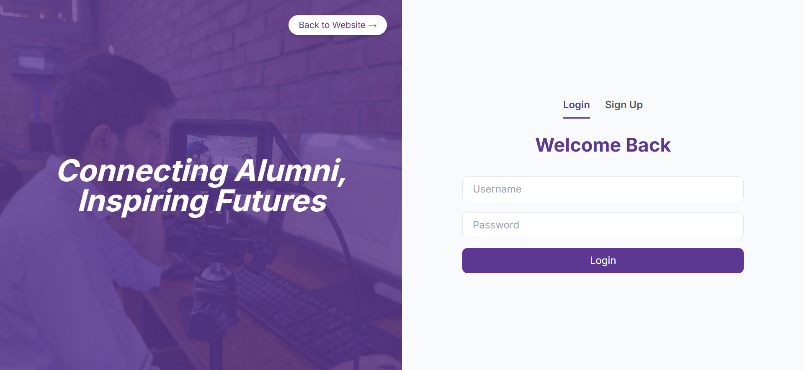
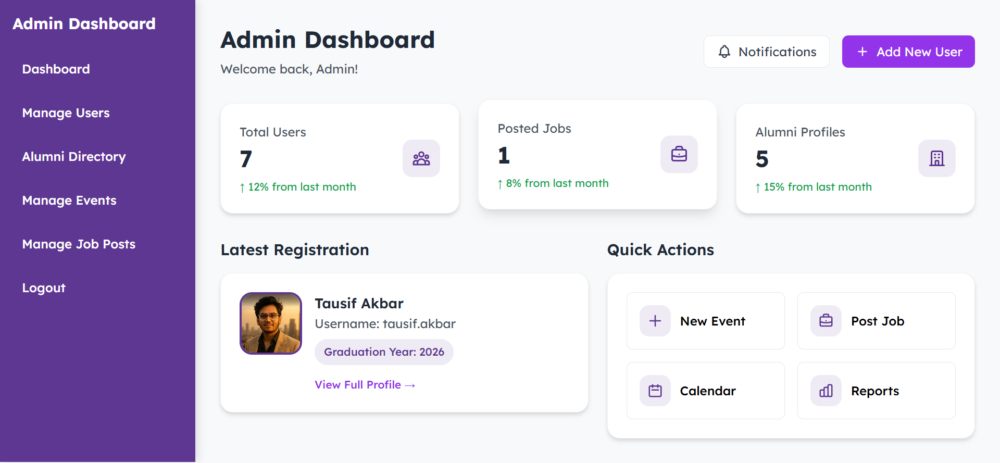
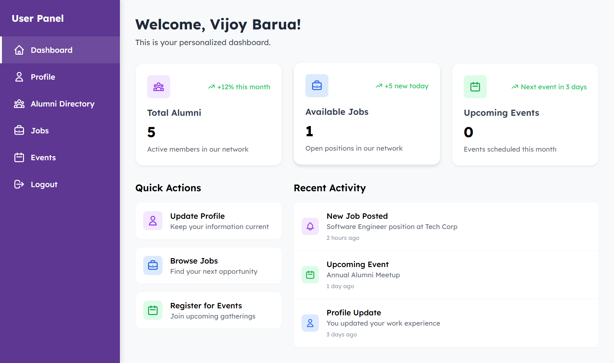

# SUBCSAA - Southern University Bangladesh Computer Science Alumni Association


> 🎓 **Perfect for Beginners!**  
> This project is designed as a learning resource for beginners who want to explore web development fundamentals. It demonstrates basic concepts of HTML, CSS, JavaScript, and PHP without complex frameworks or libraries. Great for students learning:
> - HTML5 structure and semantic elements
> - CSS styling with Tailwind CSS
> - Basic JavaScript DOM manipulation
> - Simple PHP backend operations
> - Basic database operations
> - Frontend-backend integration
> - Basic session management
> - Form handling and validation

## ⚠️ Educational Purpose Notice

This project is primarily for educational purposes and demonstrates basic web development concepts. It has some known security limitations that make it unsuitable for production use without significant improvements:

1. **Basic Session Management:**
   - Simple PHP session handling without advanced security
   - No JWT or modern token-based authentication
   - Session fixation vulnerability may exist

2. **Limited Security Features:**
   - Basic password hashing without salt
   - No rate limiting on login attempts
   - No protection against SQL injection in some queries
   - Missing CSRF protection on forms
   - Basic file upload validation

3. **Data Protection:**
   - Passwords stored with basic hashing
   - No encryption for sensitive data
   - Limited input sanitization
   - Basic error handling

These limitations are intentionally left to keep the code simple and understandable for beginners. For production use, please implement proper security measures.

## 🌟 Overview

SUBCSAA (Southern University Bangladesh Computer Science Alumni Association) is a modern web platform designed to connect and engage Computer Science alumni from Southern University Bangladesh. The platform facilitates networking, event management, and knowledge sharing among alumni members.

## ✨ Features

### 1. Modern UI/UX Design
- Consistent purple branding (#5E3792) across all pages
- Modern Lexend font family for enhanced readability
- Responsive design for all devices
- Smooth animations and transitions
- Gradient effects and decorative elements

### 2. Home Page
- Dynamic hero section with floating logo animation

- Feature highlights with 3 cards showcasing key benefits
- Facilities section with interactive elements
- Sign-in integration

### 3. About Page
- Engaging hero section with gradient text
- "Who Are We" section with modern layout
- Animated stats counter
- Goals section with icon cards


### 4. Alumni Profiles
- Modern profile cards with hover effects
- Category badges (Faculty, Industry, Academia)
- Contact information cards with gradient backgrounds
- Profile image galleries


### 5. Events Management
- Tab-based event categorization (Upcoming, Past, Featured)
- Modern event cards with date display
- Registration integration
- Event image galleries


### 6. Contact System
- Interactive contact form
- Floating contact info cards
- Subject selection with radio cards
- Form validation and submission handling


### 7. Authentication & User Management
- Secure login system with role-based access

- Different dashboards for admin and regular users


- Profile management system

**Admin Features:**
- User management dashboard
- Event approval system
- Content moderation tools
- Analytics dashboard
[Screenshot: docs/images/admin-dashboard.png]

**User Features:**
- Personal profile customization
- Event registration
- Alumni directory access
- Message board participation
[Screenshot: docs/images/user-dashboard.png]

## 🛠️ Technical Stack

- **Frontend:**
  - HTML5
  - CSS3 with Tailwind CSS
  - Vanilla JavaScript
  - Modern CSS animations and transitions

- **Backend:**
  - PHP
  - MySQL Database
  - Secure session management
  - File upload handling

## 📦 Installation

1. Clone the repository:
```bash
git clone https://github.com/yourusername/SUBCSAA.git
```

2. Set up XAMPP:
- Download and install XAMPP from https://www.apachefriends.org/
- Copy the project folder to `xampp/htdocs/`
- Start Apache and MySQL from XAMPP Control Panel

3. Import Database:
- Open phpMyAdmin (http://localhost/phpmyadmin)
- Create a new database named `subcsaa_db`
- Click on "Import" tab
- Choose the SQL file from `database/subcsaa_db.sql`
- Click "Go" to import the database structure and data

4. Set up file permissions:
- Ensure the `uploads` directory is writable
- For Windows: Right-click → Properties → Security → Edit → Allow full control for the web server user
- For Linux/Mac: `chmod 777 -R ./uploads`

## 🔧 Pre-configured Access

The system comes with pre-configured admin and user accounts for testing and initial setup. Since all passwords are securely hashed in the database, you cannot directly view them. Please refer to `docs/users.txt` for login credentials.

Available account types:
- Administrator accounts (full system access)
- Moderator accounts (event management, content moderation)
- Alumni accounts (regular user access)
- Faculty accounts (special privileges)

For security reasons, please change these passwords after your first login.

## 🚀 Usage

1. Access the website through your configured domain
2. Register as an alumni member
3. Complete your profile
4. Start connecting with other alumni
5. Participate in events and discussions

## 💪 Advantages

1. **User Experience**
   - Intuitive navigation
   - Fast loading pages
   - Smooth animations
   - Mobile-first design

2. **Security**
   - Secure session handling
   - Password encryption
   - XSS protection
   - CSRF protection

3. **Maintainability**
   - Well-organized code structure
   - Consistent coding standards
   - Comprehensive documentation
   - Modular components

4. **Scalability**
   - Optimized database queries
   - Caching implementation
   - Efficient resource loading
   - CDN support

## 🚧 Limitations & Known Issues

1. **Security Concerns:**
   - Basic session management vulnerable to hijacking
   - Limited protection against common web attacks
   - Weak password hashing implementation
   - No HTTPS enforcement
   - Basic file upload security

2. **Browser Compatibility**
   - Some animations may not work in older browsers
   - Gradient effects require modern browser support
   - Limited IE11 support

3. **Performance**
   - Large image uploads may be slow
   - Initial load time could be optimized
   - Some animations may affect performance on low-end devices

4. **Features**
   - Limited offline functionality
   - No native mobile app
   - Manual event approval process
   - Basic search functionality

## 🔜 Future Improvements

1. **Technical Enhancements**
   - Implement service workers for offline support
   - Add PWA capabilities
   - Optimize image loading and processing
   - Implement real-time notifications

2. **Feature Additions**
   - Job portal integration
   - Alumni mentorship program
   - Online event streaming
   - Mobile app development

3. **UI/UX Improvements**
   - Dark mode support
   - More accessibility features
   - Additional language support
   - Enhanced search capabilities

## 🤝 Contributing

1. Fork the repository
2. Create your feature branch (`git checkout -b feature/AmazingFeature`)
3. Commit your changes (`git commit -m 'Add some AmazingFeature'`)
4. Push to the branch (`git push origin feature/AmazingFeature`)
5. Open a Pull Request

## 📝 License

This project is licensed under the MIT License - see the [LICENSE.md](LICENSE.md) file for details.

## 👥 Developer

This project was developed by:
- **Adnan Mahmud**
  - Full Stack Developer
  - LinkedIn: [linkedin.com/in/vintech]

## 📞 Contact

For queries or collaboration:
- LinkedIn: [linkedin.com/in/vintech]

---
© 2024 SUBCSAA. All Rights Reserved. 